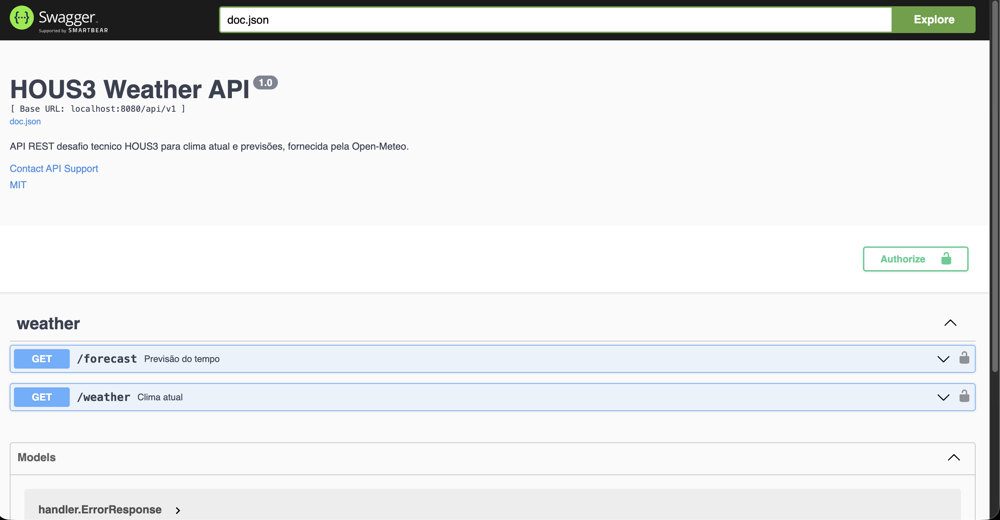
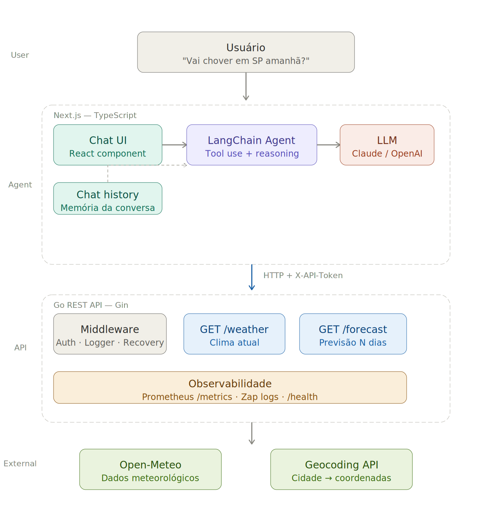
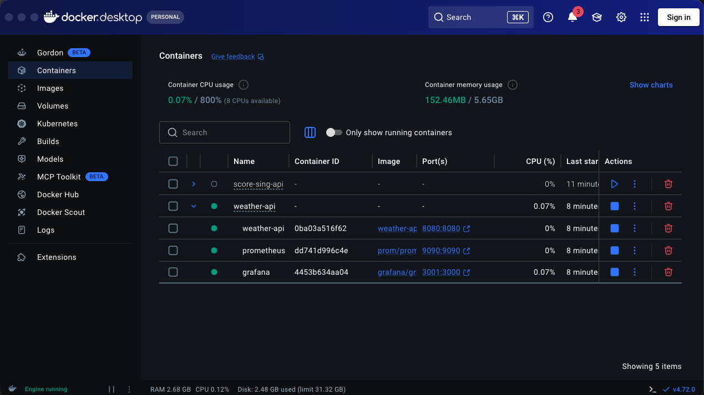
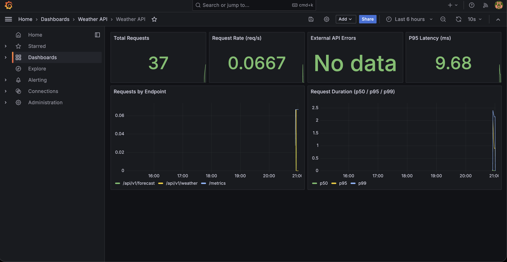

<div align="center">
  
</div>

# Hous3 Weather API 🌤️

REST API em Go para consulta de clima atual e previsão do tempo, construída com Open-Meteo.

<div align="center">
  
</div>

<div align="center">
  
</div>

## Tabela de conteúdo

- [Técnicas e tecnologias utilizadas](#técnicas-e-tecnologias-utilizadas)
- [Estrutura de arquivos](#estrutura-de-arquivos)
- [Abrir e rodar](#abrir-e-rodar)
- [Endpoints](#endpoints)
- [Observabilidade](#observabilidade)
- [Decisões técnicas e trade-offs](#decisões-técnicas-e-trade-offs)

## Técnicas e tecnologias utilizadas

- **Gin**: Framework HTTP leve e performático para construção da API REST.
- **Open-Meteo**: Provedor de dados meteorológicos gratuito, sem necessidade de API key.
- **Prometheus + Grafana**: Observabilidade completa com métricas expostas e dashboard pré-provisionado.
- **Swagger (swaggo)**: Documentação interativa da API gerada a partir de anotações no código.
- **Zap**: Logs JSON estruturados com request ID em toda requisição para facilitar correlação.
- **Static Token (`X-API-Token`)**: Autenticação M2M via header com comparação em tempo constante.
- **Docker + Docker Compose**: Containerização multi-stage com imagem distroless e stack completa orquestrada.
- **Graceful Shutdown**: Encerramento controlado do servidor com timeout configurável.
- **Hot-reload com Air**: Recarregamento automático em desenvolvimento.

### Stack resumida

| Camada | Tecnologia |
|--------|-----------|
| Framework | Gin |
| Observabilidade | Prometheus + Grafana |
| Documentação | Swagger (swaggo) |
| Logs | Zap (JSON estruturado) |
| Dados meteorológicos | Open-Meteo (gratuito, sem key) |
| Autenticação | Static token (`X-API-Token`) |
| Containerização | Docker + Docker Compose |

## Estrutura de arquivos

```
weather-api/
├── cmd/api/main.go                 # Entrypoint, router, graceful shutdown
├── internal/
│   ├── auth/auth.go                # Validação de token (constant-time)
│   ├── config/config.go            # Leitura de env vars
│   ├── handler/handler.go          # Handlers HTTP + Swagger annotations
│   ├── logger/logger.go            # Zap global
│   ├── middleware/middleware.go     # RequestID, Logger, Recovery, StaticToken
│   ├── monitor/monitor.go          # Prometheus metrics + health endpoints
│   └── weather/service.go          # Integração Open-Meteo + geocoding
├── scripts/
│   ├── prometheus.yml              # Scrape config
│   └── grafana/provisioning/       # Datasource + dashboard auto-provisionados
├── docs/                           # Swagger gerado pelo swag
├── Dockerfile                      # Multi-stage, imagem distroless
├── docker-compose.yml              # API + Prometheus + Grafana
└── Makefile
```

## Abrir e rodar

**Para executar este projeto você precisa:**

- Ter o [Go 1.24+](https://go.dev/dl/) instalado
- Ter o [Docker](https://www.docker.com/) e Docker Compose instalados
- Ter o [swag CLI](https://github.com/swaggo/swag) para gerar a documentação Swagger

**Passos para rodar:**

1. Clone o repositório:
```bash
git clone https://github.com/yourorg/weather-api
cd weather-api
```

2. Configure as variáveis de ambiente:
```bash
cp .env
# Edite o .env e defina um STATIC_API_TOKEN
```

3. Gere a documentação Swagger:
```bash
go install github.com/swaggo/swag/cmd/swag@latest
make swagger
```

4. Rode com hot-reload (desenvolvimento):
```bash
go install github.com/air-verse/air@latest
go mod tidy
make run
```

5. Ou rode a stack completa com Docker:
```bash
make docker-up
```

Serviços disponíveis após subir a stack:

| Serviço | URL |
|---------|-----|
| Weather API | http://localhost:8080 |
| Swagger UI | http://localhost:8080/swagger/index.html |
| Prometheus | http://localhost:9090 |
| Grafana | http://localhost:3001 (admin/admin) |

<div align="center">
  
</div>

## Endpoints

Todos os endpoints da API requerem o header `X-API-Token`.

### `GET /api/v1/weather?city={city}`

Retorna as condições climáticas atuais para uma cidade.

```bash
curl -H "X-API-Token: seu-token" \
  "http://localhost:8080/api/v1/weather?city=São Paulo"
```

```json
{
  "city": "São Paulo",
  "country": "Brazil",
  "latitude": -23.5475,
  "longitude": -46.6361,
  "temperature_c": 24.5,
  "windspeed_kmh": 12.3,
  "weathercode": 2,
  "description": "Parcialmente nublado",
  "time": "2026-05-08T14:00"
}
```

### `GET /api/v1/forecast?city={city}&days={n}`

Retorna a previsão para os próximos N dias (1–16, padrão 7).

```bash
curl -H "X-API-Token: seu-token" \
  "http://localhost:8080/api/v1/forecast?city=Rio de Janeiro&days=3"
```

### Endpoints públicos (sem token)

| Endpoint | Descrição |
|----------|-----------|
| `GET /health` | Health geral |
| `GET /health/liveness` | Liveness probe |
| `GET /health/readiness` | Readiness probe |
| `GET /metrics` | Métricas Prometheus |
| `GET /swagger/*` | Swagger UI (somente em não-produção) |

## Observabilidade

Métricas expostas em `/metrics`:

| Métrica | Tipo | Descrição |
|---------|------|-----------|
| `weather_api_requests_total` | Counter | Total de requisições por método, endpoint e status |
| `weather_api_request_duration_seconds` | Histogram | Latência das requisições |
| `weather_api_external_errors_total` | Counter | Erros em chamadas ao Open-Meteo |
| `weather_api_external_duration_seconds` | Histogram | Latência das chamadas externas |

O Grafana já vem com dashboard pré-provisionado mostrando total de requests, request rate, erros externos e latência p50/p95/p99.

<div align="center">
  
</div>

## Decisões técnicas e trade-offs

**Open-Meteo**: escolhido por ser gratuito e não exigir API key, reduzindo fricção para qualquer pessoa que quiser rodar o projeto. Em produção, avaliaria OpenWeatherMap ou Tomorrow.io para SLAs mais robustos.

**Static token**: suficiente para o escopo do desafio (M2M entre o agent Next.js e a API). Em produção, substituiria por JWT com rotação ou OAuth2 client credentials.

**Logs estruturados via Zap**: logs JSON com request ID em toda requisição facilitam correlação em ambientes com múltiplas instâncias.

**O que faria diferente em produção**:
- Cache Redis nos endpoints de clima (TTL ~10min) para reduzir chamadas ao Open-Meteo
- OpenTelemetry para traces distribuídos além das métricas
- Rate limiting por IP/token
- Circuit breaker nas chamadas externas (ex: `sony/gobreaker`)
- Testes de integração e contrato com a API externa

